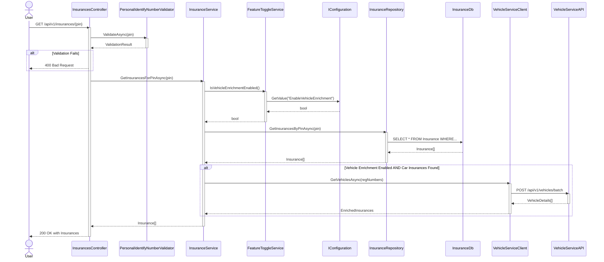

# Get Insurances Sequence Diagram

```mermaid
sequenceDiagram
    actor User
    participant InsurancesController
    participant PersonalIdentifyNumberValidator
    participant InsuranceService
    participant FeatureToggleService
    participant IConfiguration
    participant InsuranceRepository
    participant InsuranceDb
    participant VehicleServiceClient
    participant VehicleServiceAPI

    User->>InsurancesController: GET /api/v1/insurances/{pin}
    activate InsurancesController

    InsurancesController->>PersonalIdentifyNumberValidator: ValidateAsync(pin)
    activate PersonalIdentifyNumberValidator
    PersonalIdentifyNumberValidator-->>InsurancesController: ValidationResult
    deactivate PersonalIdentifyNumberValidator

    alt Validation Fails
        InsurancesController-->>User: 400 Bad Request
    end

    InsurancesController->>InsuranceService: GetInsurancesForPinAsync(pin)
    activate InsuranceService

    InsuranceService->>FeatureToggleService: IsVehicleEnrichmentEnabled()
    activate FeatureToggleService
    FeatureToggleService->>IConfiguration: GetValue("EnableVehicleEnrichment")
    IConfiguration-->>FeatureToggleService: bool
    FeatureToggleService-->>InsuranceService: bool
    deactivate FeatureToggleService

    InsuranceService->>InsuranceRepository: GetInsurancesByPinAsync(pin)
    activate InsuranceRepository
    InsuranceRepository->>InsuranceDb: SELECT * FROM Insurance WHERE...
    InsuranceDb-->>InsuranceRepository: Insurance[]
    InsuranceRepository-->>InsuranceService: Insurance[]
    deactivate InsuranceRepository

    alt Vehicle Enrichment Enabled AND Car Insurances Found
        InsuranceService->>VehicleServiceClient: GetVehiclesAsync(regNumbers)
        activate VehicleServiceClient
        VehicleServiceClient->>VehicleServiceAPI: POST /api/v1/vehicles/batch
        activate VehicleServiceAPI
        VehicleServiceAPI-->>VehicleServiceClient: VehicleDetails[]
        deactivate VehicleServiceAPI
        VehicleServiceClient-->>InsuranceService: EnrichedInsurances
        deactivate VehicleServiceClient
    end

    InsuranceService-->>InsurancesController: Insurance[]
    deactivate InsuranceService

    InsurancesController-->>User: 200 OK with Insurances
    deactivate InsurancesController
```
