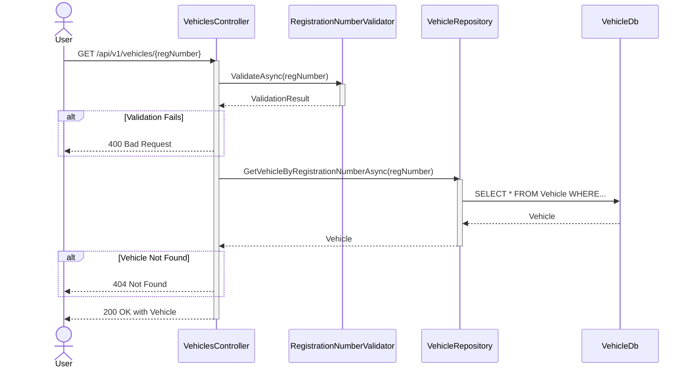

# Get Vehicle Sequence Diagram

```mermaid
sequenceDiagram
    actor User
    participant VehiclesController
    participant RegistrationNumberValidator
    participant VehicleRepository
    participant VehicleDb

    User->>VehiclesController: GET /api/v1/vehicles/{regNumber}
    activate VehiclesController

    VehiclesController->>RegistrationNumberValidator: ValidateAsync(regNumber)
    activate RegistrationNumberValidator
    RegistrationNumberValidator-->>VehiclesController: ValidationResult
    deactivate RegistrationNumberValidator

    alt Validation Fails
        VehiclesController-->>User: 400 Bad Request
    end

    VehiclesController->>VehicleRepository: GetVehicleByRegistrationNumberAsync(regNumber)
    activate VehicleRepository
    VehicleRepository->>VehicleDb: SELECT * FROM Vehicle WHERE...
    VehicleDb-->>VehicleRepository: Vehicle
    VehicleRepository-->>VehiclesController: Vehicle
    deactivate VehicleRepository

    alt Vehicle Not Found
        VehiclesController-->>User: 404 Not Found
    end

    VehiclesController-->>User: 200 OK with Vehicle
    deactivate VehiclesController
```
