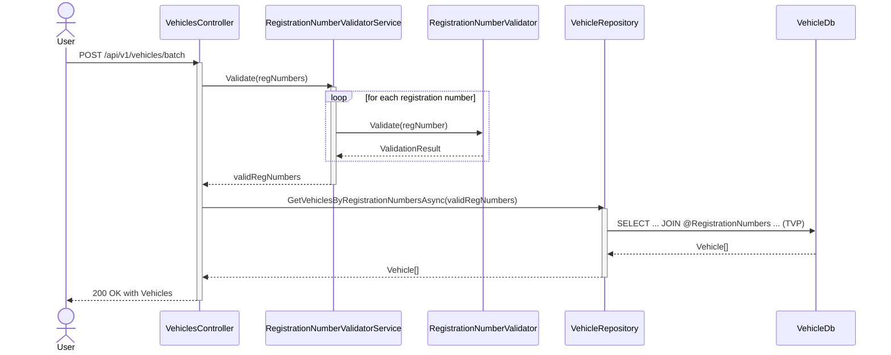

# Get Vehicles Batch Sequence Diagram

```mermaid
sequenceDiagram
    actor User
    participant VehiclesController
    participant RegistrationNumberValidatorService
    participant RegistrationNumberValidator
    participant VehicleRepository
    participant VehicleDb

    User->>VehiclesController: POST /api/v1/vehicles/batch
    activate VehiclesController

    VehiclesController->>RegistrationNumberValidatorService: Validate(regNumbers)
    activate RegistrationNumberValidatorService

    loop for each registration number
        RegistrationNumberValidatorService->>RegistrationNumberValidator: Validate(regNumber)
        RegistrationNumberValidator-->>RegistrationNumberValidatorService: ValidationResult
    end

    RegistrationNumberValidatorService-->>VehiclesController: validRegNumbers
    deactivate RegistrationNumberValidatorService

    VehiclesController->>VehicleRepository: GetVehiclesByRegistrationNumbersAsync(validRegNumbers)
    activate VehicleRepository
    VehicleRepository->>VehicleDb: SELECT ... JOIN @RegistrationNumbers ... (TVP)
    VehicleDb-->>VehicleRepository: Vehicle[]
    VehicleRepository-->>VehiclesController: Vehicle[]
    deactivate VehicleRepository

    VehiclesController-->>User: 200 OK with Vehicles
    deactivate VehiclesController
```
