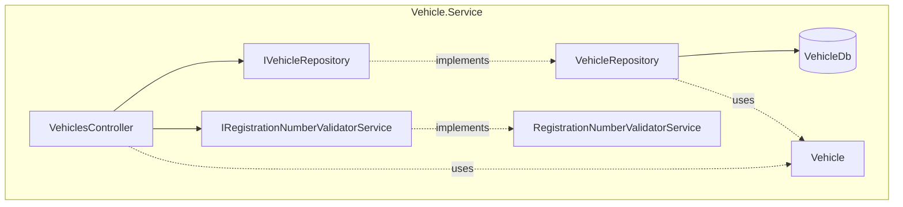

# Vehicle Service Architecture

```mermaid
graph TD
    subgraph "Vehicle.Service"
        Controller[VehiclesController]
        IRepo[IVehicleRepository]
        Repo[VehicleRepository]
        IValidatorService[IRegistrationNumberValidatorService]
        ValidatorService[RegistrationNumberValidatorService]
        Model[Vehicle]
        Db[(VehicleDb)]

        Controller --> IRepo
        Controller --> IValidatorService
        IRepo -. implements .-> Repo
        IValidatorService -. implements .-> ValidatorService
        Repo --> Db
        Controller -. uses .-> Model
        Repo -. uses .-> Model
    end
```
